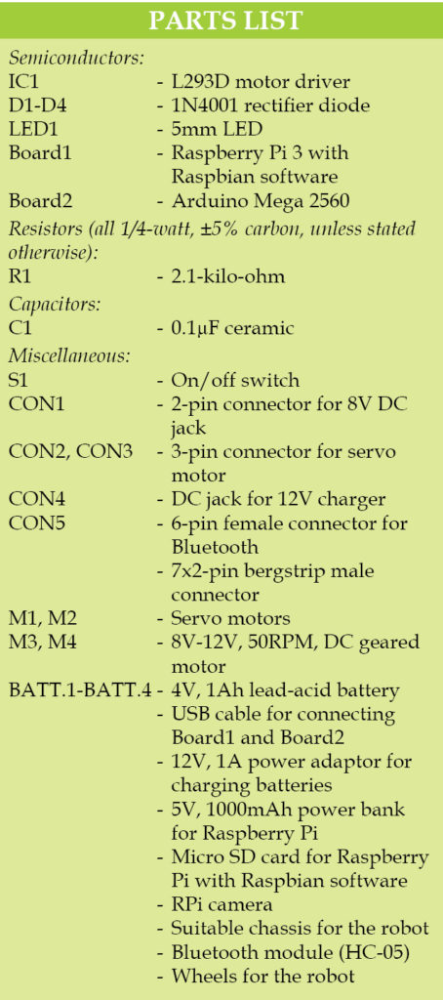
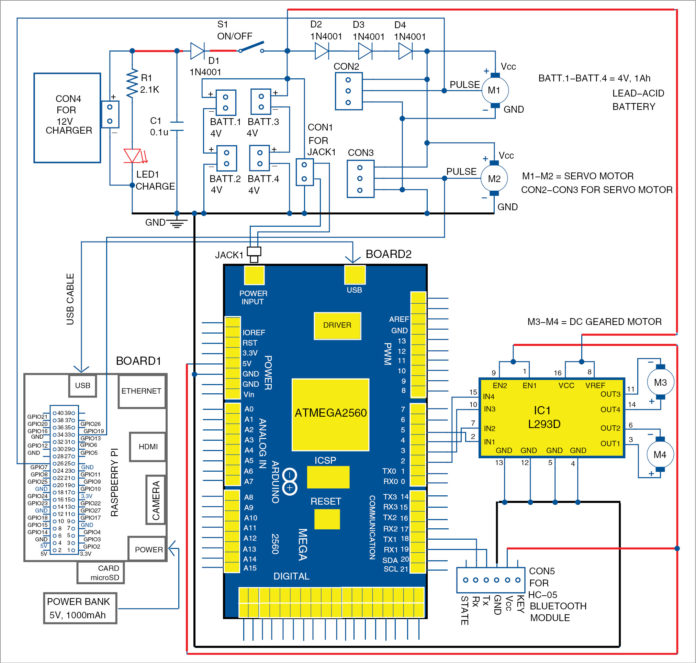
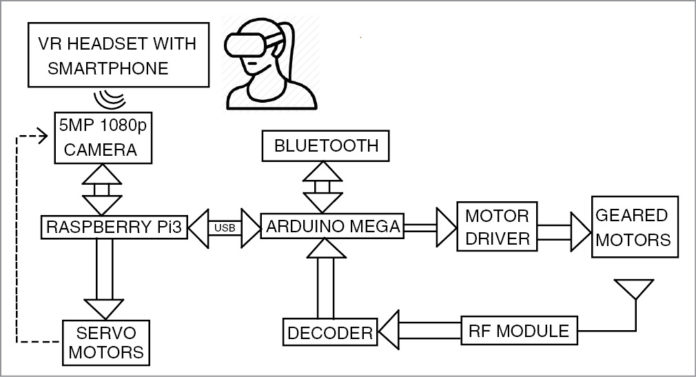
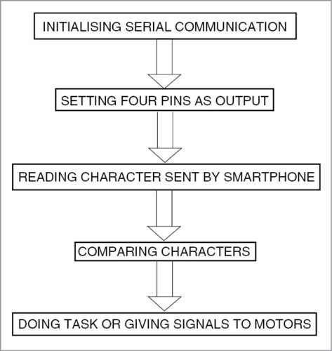
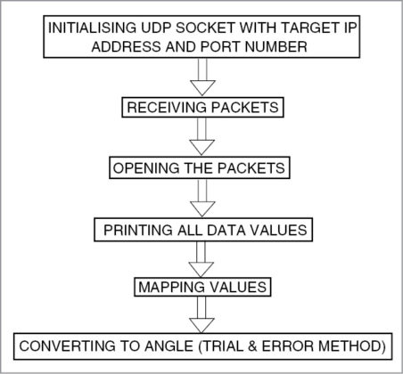
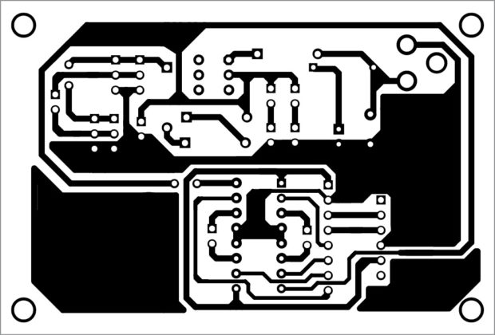
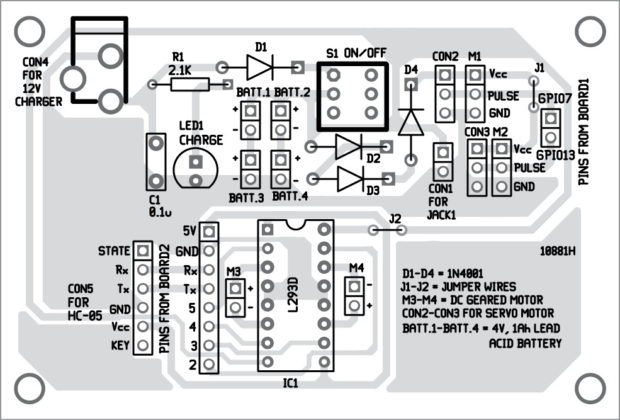

# Virtual Presence Robot

The Virtual Presence Robot is designed to facilitate remote interaction by allowing users to navigate and observe environments from a distance. This project integrates hardware components with software control to provide real-time presence in a remote location.

## Features

- **Remote Navigation**: Control the robot's movement remotely to explore different areas.
- **Real-Time Video Streaming**: Transmit live video feed from the robot's perspective to the user.
- **Obstacle Detection**: Utilize sensors to detect and avoid obstacles during navigation.

## Components



The main components used in this project include:

- **Microcontroller**: Arduino Uno
- **Motors**: DC motors with motor driver
- **Sensors**: Ultrasonic sensors for obstacle detection
- **Camera Module**: For real-time video streaming
- **Chassis**: Robot base to house all components

## Circuit Diagram



The circuit diagram illustrates the connections between the Arduino, motors, sensors, and other components.

## Block Diagram



The block diagram provides an overview of the system architecture and data flow.

## Flowchart



The flowchart outlines the operational logic and sequence of actions performed by the robot.

## Algorithm



The algorithm details the step-by-step process for the robot's navigation and obstacle avoidance.

## Software

- **Arduino Code**: The `arduino_code.ino` file contains the code uploaded to the Arduino for controlling the hardware components.
- **Python Code**: The `code.py` file manages higher-level functions such as video streaming and remote control interfaces.

## PCB Layouts




The PCB layouts depict the design of custom circuit boards used in the project.
